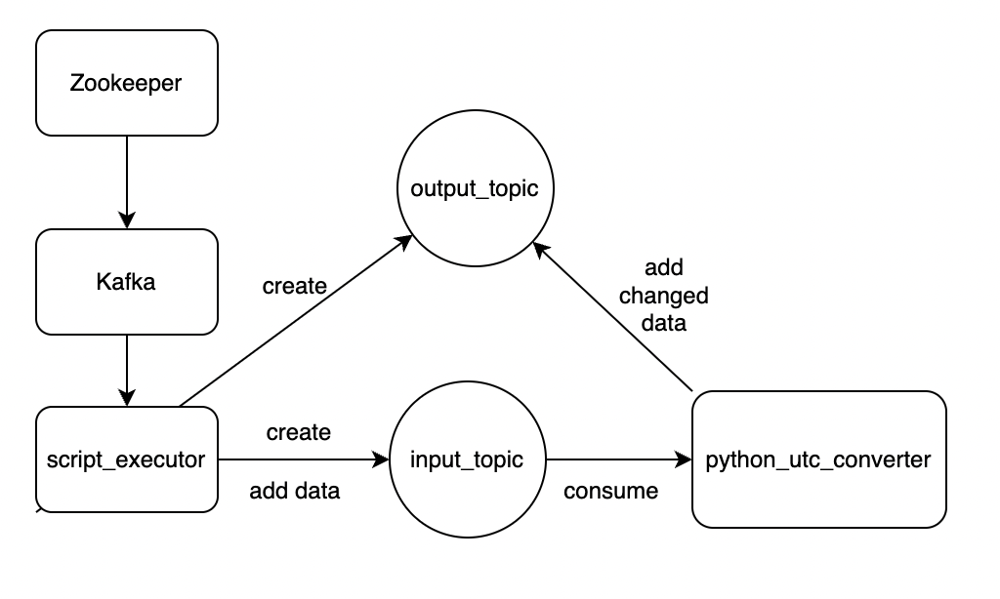
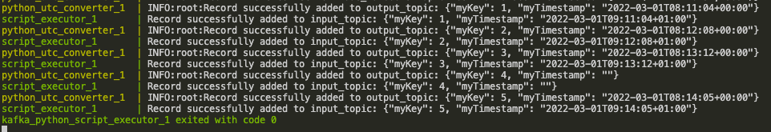

# Simple Kafka Application

This is a simple Python Kafka application that reads data from a Kafka topic, performs some transformation and pushs the transformed data into another topic.

## Description
The architecture has 4 services as can be seen in `docker-compose.yml` and the diagram below.

Zookeeper is well-known as the house-keeping tool for the Kafka cluster, e.g. track the status of nodes, leader election, etc. 

Once Zookeeper is up and running, Docker will start to spin up the Kafka container. For Kafka container, a healthcheck will try to create a test topic.

Once the test topic is created, the container is deemed healthy and will trigger Docker to start the next two containers.

One of the next two container is called `script_executor`. This container will execute a bashscript that creates the two `input_topic` and `output_topic` and adds data into `input_topic`. This container uses the same image as Kafka container, but doesn't spin up a new Kafka broker. It contains Kafka CLI API that the bash script uses to create topics and produce records to topics.

The other container is called `python_utc_converter`. This container contains a Python application that will read from input_data, convert timezoned myTimestamp into UTC, and push the payload with the converted myTimestamp into output_topic.

## Installation

Note: Highly recommend to run this on a Linux environment or a UNIX envirnoment with stable Docker engine. After some test, this is run with stable performance on Ubuntu 20.04 LTS, but with many issues on MacOS M1.

Once you have cloned the repo, simply run the following command:

```
docker-compose up --build
```

It can take quite some time for the services to be up and running, the script in `script_executor` to be executed successfully and the python application in `python_utc_converter` to be deployed successfully.

The whole operation is considered successful if you could see something similar to the following in STDOUT:



## Troubleshooting

There are some scenarios where things don't go as expected. This section will go through some scenarios I'm aware of.

### Scenario 1: The service script_executor doesn't work

Please note that after the Kafka container is healthy, the service `script_executor` will sleep for 60 seconds before executing the bash script.

But there is a scenario where for some reason the service appears to freeze. In this case, you can manually execute the bash script. The bash script is also available in the Kafka container itself. You can enter the terminal of the Kafka container and manually execute the script with two steps.

Step 1: Enter the terminal of the Kafka container

In your terminal, enter:

`docker exec -it $(echo $(docker ps | grep kafka_python_kafka) | cut -c1-12) bash`

Step 2: Execute the script:

`/kafka/bashscripts/create_topic_and_push_data.sh`

Note: Sometimes the script just takes forever to run even when you run it manually, most probably because the Kafka broker is no longer healhty. In this case please just remove the Kafka container with `docker rm --force $(echo $(docker ps -a | grep kafka_python_kafka) | cut -c1-12)` and run the docker-compose again with `docker-compose up --build`.

### Scenario 2: The Kafka container fails to be created or fails to become healthy

In this case, please just stop the operation with ctrl+c and rerun the docker-compose.

`docker-compose up --build`

## Author
Gia Phat Tram
